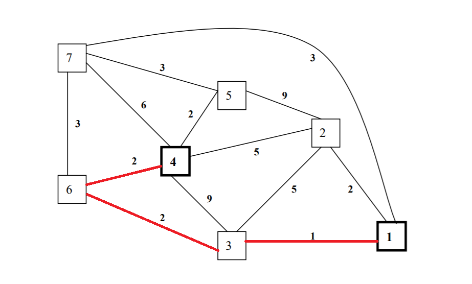
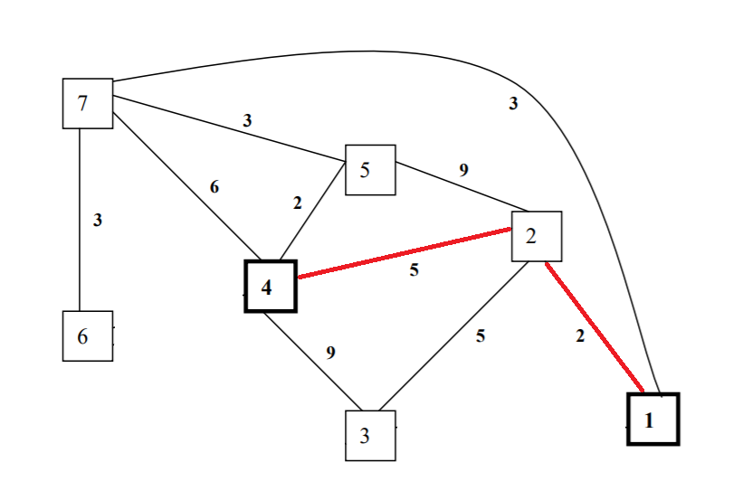
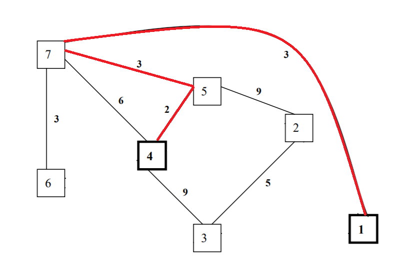

# 3-Link-Disjoint-Dijkstra-Algorithm

## About
In this project, we implemented 3-link disjoint Dijkstra Algorithm where we find the shortest path from a source node to a destination node iteratively 3 times. After each iteration we eliminate the shortest path and find the new shortest path in its absence. This simulates a real time situation that could arise while routing networks where the shortest route cannot be accessed due to some physical damaged or some other problem. In this situation it is necessary for the routing algorithm to find the next shortest path in the network so the packets could be routed successfully. Hence, it is necessary that the network be continuously monitored, and routing table be simultaneously updated with the shortest path to destination node.

## Shortest Path Diagrams

<em>First Link disjoint shortest path, distance = 5</em>

<em>Second Link disjoint shortest path, distance = 7</em>

<em>Third Link disjoint shortest path, distance = 8</em>

